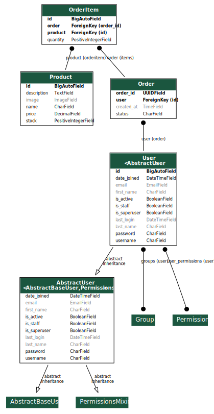

# **DRFshop**  
## This is a shop website that uses Django Rest Framework (DRF)  

---

## **Content**  
- [Description](#description)  
- [Requirements](#requirements)  
- [Installing](#installing)  
- [Starting work with the app](#starting-work-with-the-app)  
- [API app structure](#api-app-structure)  
- [Contacts](#contacts)  

---

## **Description**  
DRFshop is a web-based shop application built using Django Rest Framework (DRF).  
The application provides an API for managing products, orders, and users.  
It includes functionality for user authentication, product listings, order management, and more.  

---

## **Requirements**  
Before you start, make sure you have the following installed:  
- **Python**: 3.9+  
- **Django**: 4.0+  
- **Django Rest Framework (DRF)**  

You will also need `pip` and `virtualenv` to manage dependencies.

---

## **Installing**  
Follow these steps to set up the project on your local machine:  

1. **Clone the repository:**  
   ```bash
   git clone https://github.com/danilgubarev/DRFshop

2. **Navigate to the project directory:**  
   ```bash
   cd DRFshop

3. **Create a virtual environment:**  
   ```bash
   python -m venv venv

4. **Activate the virtual environment:**  
- On Windows:
   ```bash
   venv\Scripts\activate

- On Linux/macOS:
   ```bash
   source venv/bin/activate

5. **Install the required packages:**  
   ```bash
   pip install -r requirements.txt
---
## **Starting work with the app**

1. **Apply database migrations:**  
   ```bash
   python manage.py migrate

2. **Start the development server:**  
   ```bash
   python manage.py runserver

---
## API app structure


---
## Contacts
**For any questions, issues, or suggestions, feel free to contact me:**

- Author: **Danil Gubarev**
- GitHub: [ **danilgubarev** ](https://github.com/danilgubarev)

